# System Architecture

> **Project:** Order Management Renewal Service  
> **Last Updated:** December 4, 2025

---

## Table of Contents

1. [High-Level Architecture](#high-level-architecture)
2. [Component Architecture](#component-architecture)
3. [Data Flow Diagrams](#data-flow-diagrams)
4. [Authentication Flow](#authentication-flow)
5. [Database Architecture](#database-architecture)
6. [Scheduler Architecture](#scheduler-architecture)
7. [External Integrations](#external-integrations)
8. [Deployment Architecture](#deployment-architecture)

---

## High-Level Architecture

The Order Management Renewal Service is a Spring Boot microservice that orchestrates motor insurance policy renewals for Liberty Insurance Hong Kong. It integrates with multiple internal and external systems.

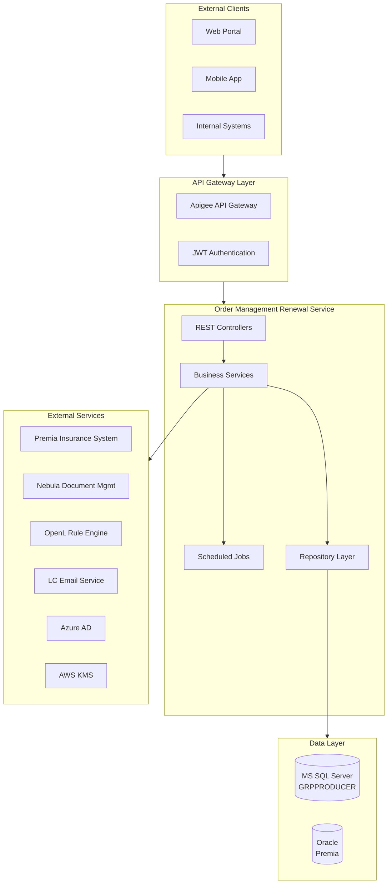

---

## Component Architecture

### Application Layers

```mermaid
flowchart TB
    subgraph Presentation["Presentation Layer"]
        OrderMgmtController[OrderManagementController]
        KmsController[KmsController]
    end
   
    subgraph Business["Business Logic Layer"]
        subgraph Services["Service Interfaces"]
            DistributeSvc[DistributeRenewalService]
            SubmitSvc[SubmitRenewalService]
            UploadSvc[UploadRenewalService]
            SearchSvc[SearchRenewalService]
            MotorSvc[MotorUnderwrittenRenewalService]
            EmailSvc[EmailService]
            NebulaSvc[NebulaService]
            OrderSvc[OrderService]
            OfferSvc[OfferService]
            RuleEngineSvc[RenewalOfferRuleEngineService]
        end
       
        subgraph Implementations["Service Implementations"]
            DistributeSvcImpl[DistributeRenewalServiceImpl]
            SubmitSvcImpl[SubmitRenewalServiceImpl]
            UploadSvcImpl[UploadRenewalServiceImpl]
            SearchSvcImpl[SearchRenewalServiceImpl]
            MotorSvcImpl[MotorUnderwrittenRenewalServiceImpl]
            EmailSvcImpl[EmailServiceImpl]
            NebulaSvcImpl[NebulaServiceImpl]
            OrderSvcImpl[OrderServiceImpl]
            OfferSvcImpl[OfferServiceImpl]
        end
    end
   
    subgraph Repository["Data Access Layer"]
        DistributeRepo[DistributeRenewalServiceRepo]
        UploadRepo[UploadRenewalServiceRepo]
        SearchRepo[SearchRenewalServiceRepo]
        MotorRepo[MotorUnderwrittenRenewalRepo]
        OrderRepo[OrderRepo]
        OfferRepo[OfferRepo]
    end
   
    Presentation --> Services
    Services --> Implementations
    Implementations --> Repository
```

### Service Responsibilities

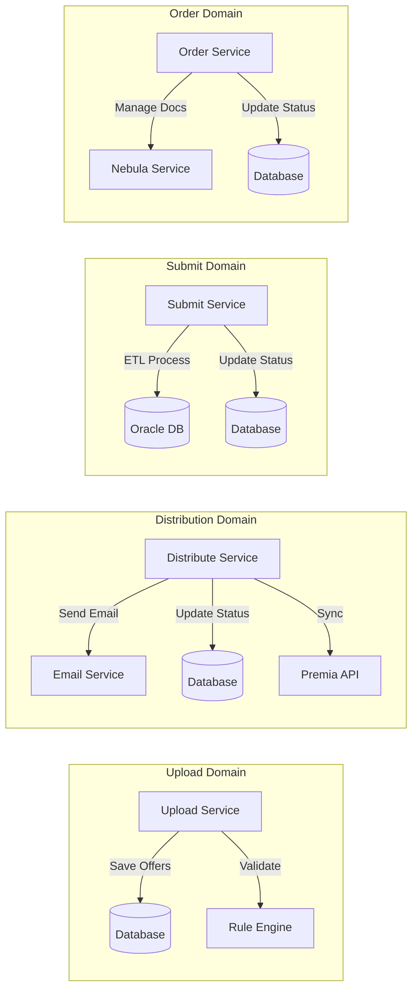

---

## Data Flow Diagrams

### Renewal Offer Upload Flow

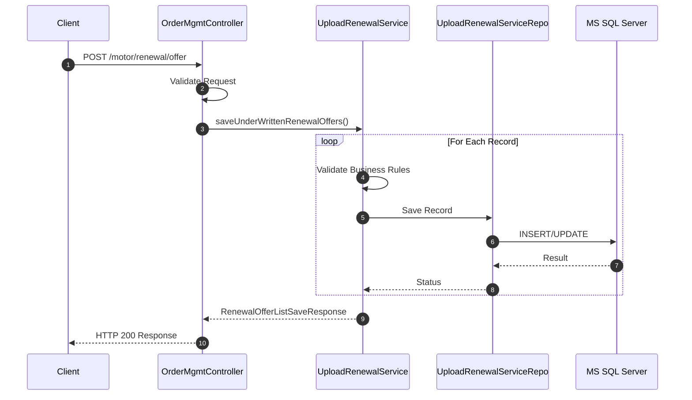

### Renewal Offer Distribution Flow

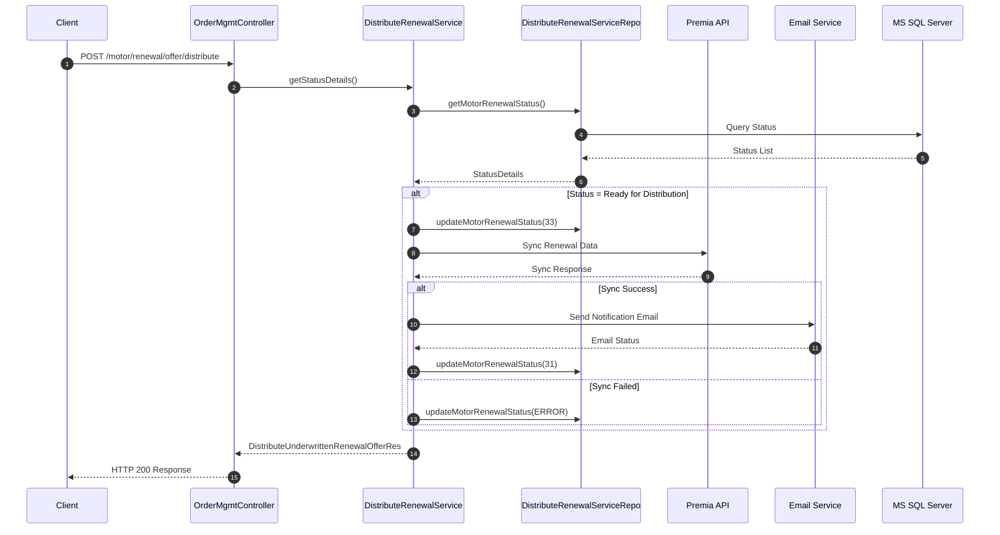

### Submit to Premia Flow

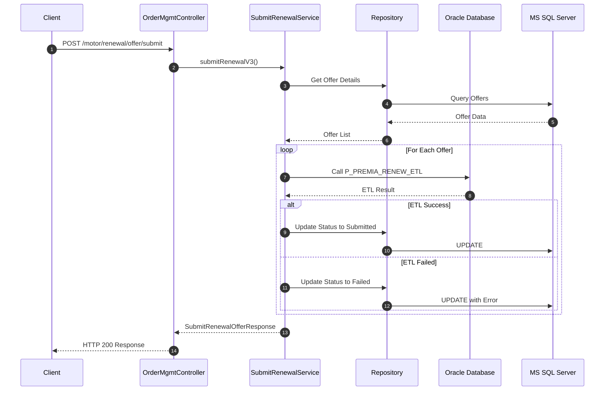

---

## Authentication Flow

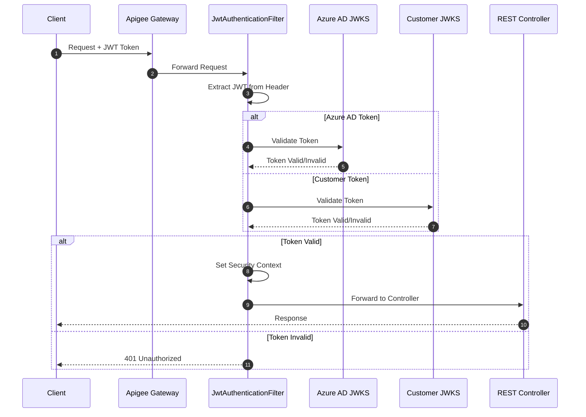

---

## Database Architecture

### Multi-Database Configuration

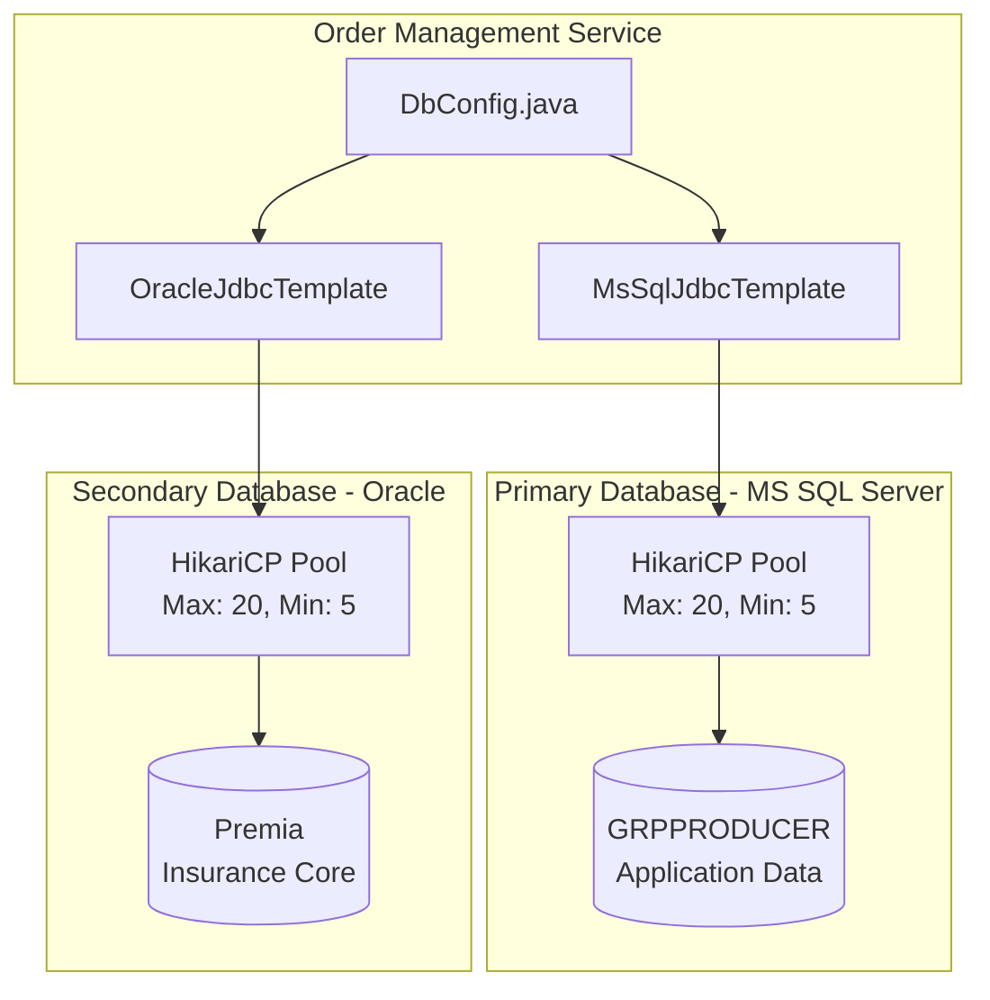

### Entity Relationships

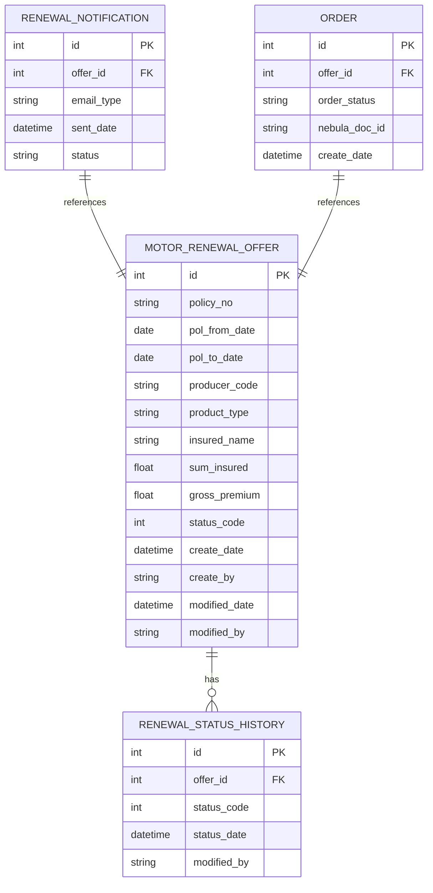

---

## Scheduler Architecture

### Scheduled Jobs Overview

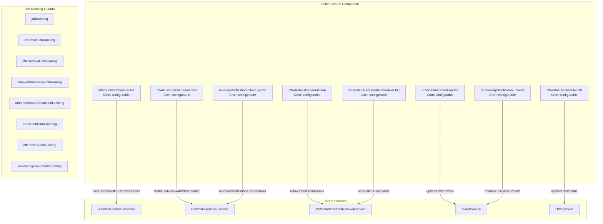

### Job State Machine

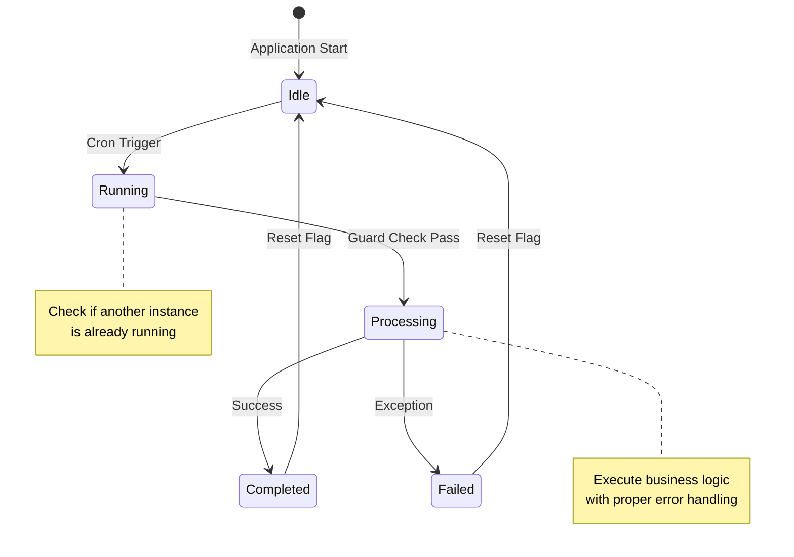

---

## External Integrations

### Integration Points

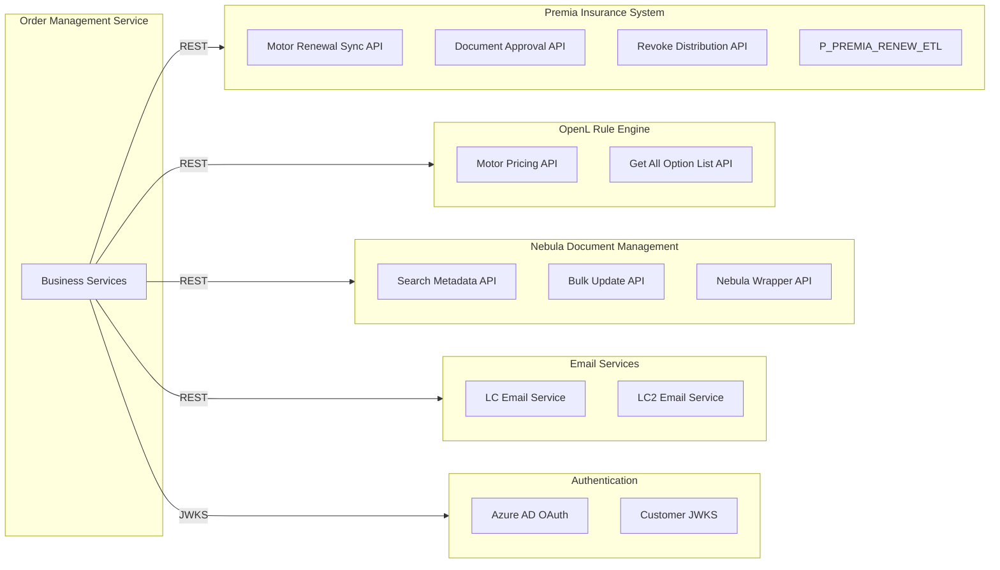

### Integration Configuration

| Integration | Base URL Pattern | Authentication |
|-------------|------------------|----------------|
| Premia Sync | `motor.renewal.sync.url` | Internal Certificate |
| OpenL Pricing | `motor.pricing.renewal.url` | None |
| Nebula | `nebula.searchMetadataUrl` | Azure OAuth + API Key |
| LC Email | `lcemail.urlEmail` | API Key |
| LC2 Email | `lc2email.urlEmail` | API Key |

---

## Deployment Architecture

### Container Architecture

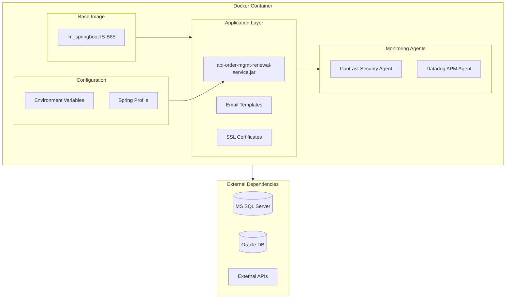

### CI/CD Pipeline

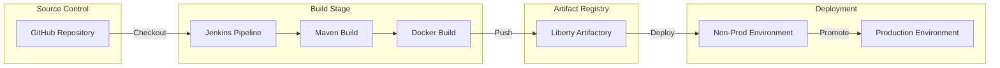

---

## Security Architecture

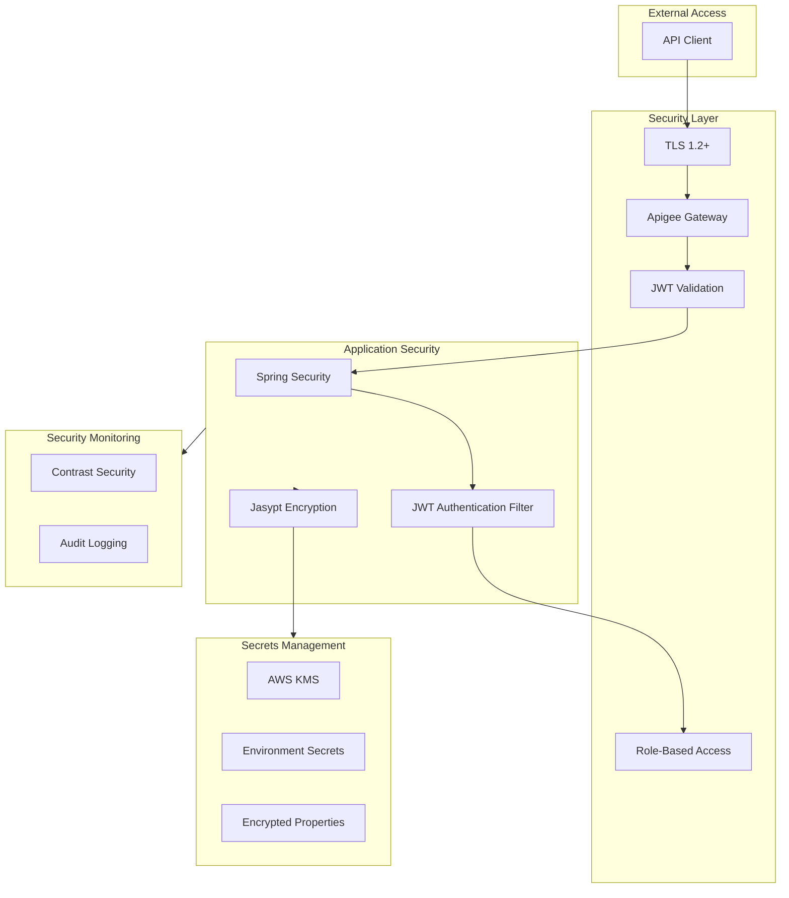

---

## Network Architecture

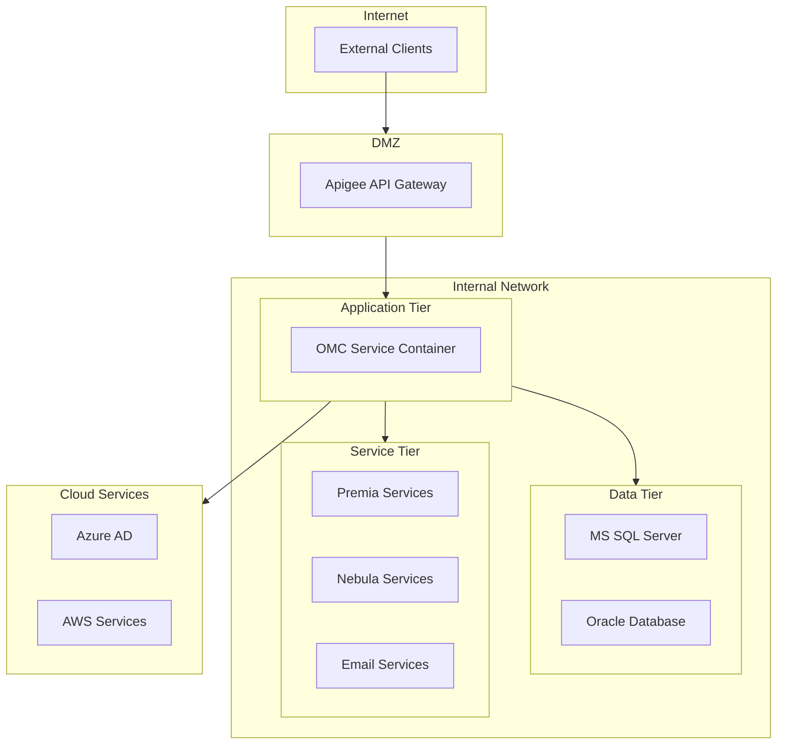
