# System Architecture Documentation

> **Document Version:** 1.0  
> **Last Updated:** December 4, 2025  
> **Project:** Order Management Renewal Service

---

## Table of Contents

1. [Architecture Overview](#architecture-overview)
2. [High-Level Architecture](#high-level-architecture)
3. [Component Architecture](#component-architecture)
4. [Data Architecture](#data-architecture)
5. [Integration Architecture](#integration-architecture)
6. [Security Architecture](#security-architecture)
7. [Deployment Architecture](#deployment-architecture)
8. [Data Flow Diagrams](#data-flow-diagrams)
9. [State Diagrams](#state-diagrams)
10. [Sequence Diagrams](#sequence-diagrams)

---

## Architecture Overview

The Order Management Renewal Service is a Spring Boot microservice that manages the motor insurance policy renewal lifecycle. It follows a layered architecture pattern with clear separation of concerns between presentation, business logic, and data access layers.

### Key Architecture Principles

| Principle | Implementation |
|-----------|----------------|
| **Separation of Concerns** | Distinct layers for controllers, services, repositories |
| **Dependency Injection** | Spring IoC container for loose coupling |
| **RESTful Design** | HTTP-based API following REST conventions |
| **Database Abstraction** | Repository pattern with JDBC templates |
| **Externalized Configuration** | Environment-specific property files |
| **Scheduled Operations** | Spring Scheduler for automated tasks |

---

## High-Level Architecture


---

## Component Architecture

### Application Layers


### Controller Responsibilities


### Service Dependencies


---

## Data Architecture

### Database Schema Overview


### Database Connections


### Data Flow Between Systems

```mermaid
flowchart LR
    subgraph Source["📥 Source Systems"]
        Premia1[(Premia<br/>Policy Data)]
        Upload[Batch Upload<br/>CSV/JSON]
    end
   
    subgraph Processing["⚙️ Processing"]
        OMRS[Order Mgmt<br/>Renewal Service]
    end
   
    subgraph Storage["💾 Storage"]
        MSSQL[(SQL Server<br/>Staging)]
    end
   
    subgraph Target["📤 Target Systems"]
        Premia2[(Premia<br/>ETL Target)]
        Nebula[Nebula<br/>Documents]
        Email[Email<br/>Notifications]
    end
   
    Premia1 -->|Offer Retrieval| OMRS
    Upload -->|Bulk Upload| OMRS
    OMRS -->|Store| MSSQL
    OMRS -->|Submit| Premia2
    OMRS -->|Update Metadata| Nebula
    OMRS -->|Send| Email
```



---

## Integration Architecture

### External System Integration Map


### Integration Protocols

| System | Protocol | Auth Method | Data Format |
|--------|----------|-------------|-------------|
| POS-WS | HTTPS/REST | x-auth-token | JSON |
| OpenL | HTTPS/REST | API Key | JSON |
| Nebula DMS | HTTPS/REST | OAuth 2.0 | JSON |
| Liberty Connect | HTTPS/REST | API Key | JSON |
| AWS KMS | HTTPS | IAM/SDK | Binary |
| Premia | JDBC | DB Auth | SQL |

### Integration Sequence - Distribution Flow

```mermaid
sequenceDiagram
    autonumber
    participant C as 🖥️ Client
    participant OM as ⚙️ Order Mgmt Service
    participant DB as 💾 SQL Server
    participant POS as 📋 POS-WS
    participant NEB as 📁 Nebula
    participant LC as 📧 Liberty Connect
   
    C->>OM: POST /offer/distribute
    OM->>DB: Get offers by ID
    DB-->>OM: Offer details
   
    OM->>DB: Update status to 33 (Distributing)
   
    OM->>POS: Motor Sync API
    POS-->>OM: Sync response
   
    alt Sync Success
        OM->>POS: Document Approval API
        POS-->>OM: Approval response
       
        OM->>NEB: Update metadata
        NEB-->>OM: Metadata updated
       
        OM->>DB: Create order record
       
        OM->>LC: Send notification email
        LC-->>OM: Email sent
       
        OM->>DB: Update status to 31 (Distributed)
        OM->>DB: Update email count
       
        OM-->>C: Success response
    else Sync Failed
        OM->>DB: Update status to 32 (Failed)
        OM-->>C: Error response with details
    end
```



---

## Security Architecture

### Security Layers

```mermaid
flowchart TB
    subgraph External["🌐 External"]
        Client[API Client]
    end
   
    subgraph Gateway["🔐 API Gateway"]
        APIGEE[APIGEE]
        RateLimit[Rate Limiting]
        APIKey[API Key Validation]
    end
   
    subgraph AppSecurity["🔒 Application Security"]
        JWTFilter[JWT Authentication Filter]
        SecConfig[Spring Security Config]
        JWKS[JWKS Validation]
    end
   
    subgraph DataSecurity["🔐 Data Security"]
        Jasypt[Jasypt Encryption]
        KMS[AWS KMS]
        TLS[TLS 1.2+]
    end
   
    Client -->|HTTPS| Gateway
    Gateway -->|Validated Request| AppSecurity
    AppSecurity -->|Authenticated| DataSecurity
```



### Authentication Flow

```mermaid
sequenceDiagram
    autonumber
    participant C as 🖥️ Client
    participant GW as 🔐 API Gateway
    participant JF as 🔑 JWT Filter
    participant JWKS as 📋 JWKS Endpoint
    participant S as ⚙️ Service
   
    C->>GW: Request + x-api-key + Bearer Token
    GW->>GW: Validate API Key
   
    alt API Key Valid
        GW->>JF: Forward Request
        JF->>JF: Extract JWT from Header
        JF->>JWKS: Fetch signing keys
        JWKS-->>JF: Public keys
        JF->>JF: Validate JWT signature
        JF->>JF: Check token expiry
       
        alt Token Valid
            JF->>S: Process request
            S-->>C: 200 OK + Response
        else Token Invalid
            JF-->>C: 401 Unauthorized
        end
    else API Key Invalid
        GW-->>C: 403 Forbidden
    end
```



### Security Configuration


---

## Deployment Architecture

### Container Architecture

```mermaid
flowchart TB
    subgraph Docker["🐳 Docker Container"]
        JVM[JVM - Java 8]
        App[Spring Boot App<br/>:8080]
        Certs[/usr/src/liberty/trust-store/]
        Templates[/usr/src/liberty/mail-templates/]
    end
   
    subgraph Config["📁 External Config"]
        Props[application-{env}.properties]
        Secrets[Vault Secrets]
    end
   
    subgraph Network["🌐 Network"]
        LB[Load Balancer]
        Ingress[Ingress Controller]
    end
   
    Config --> Docker
    Network --> Docker
```

### CI/CD Pipeline

```mermaid
flowchart LR
    subgraph Source["📁 Source"]
        Git[Git Repository<br/>master branch]
    end
   
    subgraph Build["🔨 Build"]
        Maven[Maven Build]
        Test[Unit Tests]
        Contrast[Contrast Security]
    end
   
    subgraph Package["📦 Package"]
        Docker[Docker Build]
        Push[Push to Registry]
    end
   
    subgraph Deploy["🚀 Deploy"]
        NonProd[Non-Prod<br/>Jenkinsfile]
        Prod[Production<br/>prod_Jenkinsfile]
    end
   
    Git --> Maven --> Test --> Contrast --> Docker --> Push
    Push --> NonProd
    Push --> Prod
```



### Environment Configuration


---

## Data Flow Diagrams

### Renewal Offer Lifecycle


### Scheduled Job Execution Flow


---

## State Diagrams

### Renewal Offer Status Lifecycle

```mermaid
stateDiagram-v2
    [*] --> Uploaded: Upload via API
   
    Uploaded --> ReadyForDistribution: Status 30
    ReadyForDistribution --> Distributing: Start Distribution
   
    Distributing --> Distributed: Success (31)
    Distributing --> DistributionFailed: Failed (32)
   
    DistributionFailed --> ReadyForDistribution: Retry
    DistributionFailed --> ReApproved: Re-approve (40)
   
    ReApproved --> Distributing: Redistribute
   
    Distributed --> ReDistributed: Re-distribute (14)
    Distributed --> Submitted: Submit to Premia
    Distributed --> Declined: Customer Declines
   
    ReDistributed --> Submitted: Submit
   
    Submitted --> Completed: ETL Success
    Submitted --> SubmitFailed: ETL Failed
   
    SubmitFailed --> Submitted: Retry ETL
   
    Declined --> [*]
    Completed --> [*]
   
    note right of ReadyForDistribution: Status Code: 30
    note right of Distributed: Status Code: 31
    note right of DistributionFailed: Status Code: 32
    note right of Distributing: Status Code: 33
    note right of ReApproved: Status Code: 40
    note right of ReDistributed: Status Code: 14
```

### Order Status Lifecycle


---

## Sequence Diagrams

### Upload Renewal Offers

```mermaid
sequenceDiagram
    autonumber
    participant C as 🖥️ Client
    participant Ctrl as 📋 Controller
    participant US as ⚙️ UploadService
    participant Repo as 💾 Repository
    participant DB as 🗄️ SQL Server
   
    C->>Ctrl: POST /motor/renewal/offer
    Note over C,Ctrl: JSON: List<UnderWrittenRenewalOffer>
   
    Ctrl->>Ctrl: Validate request
   
    alt Validation Failed
        Ctrl-->>C: 400 Bad Request + ErrorResponse
    end
   
    Ctrl->>US: saveUnderWrittenRenewalOffers(offers)
   
    loop For each offer
        US->>US: Validate offer data
        US->>Repo: Check if policy exists
        Repo->>DB: SELECT by policyNo
        DB-->>Repo: Result
       
        alt Policy Exists
            US->>Repo: Update existing
            Repo->>DB: UPDATE
        else New Policy
            US->>Repo: Insert new
            Repo->>DB: INSERT
        end
    end
   
    Repo-->>US: Save results
    US-->>Ctrl: RenewalOfferListSaveResponse
    Ctrl-->>C: 200 OK + Response
    Note over Ctrl,C: totalRecords, successCount, failureCount
```



### Submit Renewal to Premia

```mermaid
sequenceDiagram
    autonumber
    participant C as 🖥️ Client
    participant Ctrl as 📋 Controller
    participant SS as ⚙️ SubmitService
    participant Repo as 💾 Repository
    participant SQL as 🗄️ SQL Server
    participant ORA as 🗄️ Oracle
   
    C->>Ctrl: POST /motor/renewal/offer/submit
    Note over C,Ctrl: RenewalOfferRequestIdList
   
    Ctrl->>SS: submitRenewalV3(request)
   
    SS->>Repo: Get offers by IDs
    Repo->>SQL: SELECT offers
    SQL-->>Repo: Offer details
    Repo-->>SS: List<Offer>
   
    loop For each offer
        SS->>SS: Validate status (must be distributed)
       
        SS->>Repo: Execute ETL procedure
        Repo->>ORA: CALL P_PREMIA_RENEW_ETL
        ORA-->>Repo: ETL result
       
        alt ETL Success
            SS->>Repo: Update status to Submitted
            Repo->>SQL: UPDATE status
        else ETL Failed
            SS->>Repo: Update status to Failed
            Repo->>SQL: UPDATE status + error
        end
    end
   
    SS-->>Ctrl: SubmitRenewalOfferResponse
    Ctrl-->>C: 200 OK + Response
```

### Renewal Notification Email Flow

```mermaid
sequenceDiagram
    autonumber
    participant Sched as ⏰ Scheduler
    participant DS as ⚙️ DistributeService
    participant Repo as 💾 Repository
    participant ES as 📧 EmailService
    participant LC as 🌐 Liberty Connect
    participant DB as 🗄️ SQL Server
   
    Sched->>DS: renewalNotificationAPIScheduler()
   
    DS->>Repo: getRenewalNotification()
    Repo->>DB: SELECT eligible offers
    Note over Repo,DB: Status = Distributed<br/>Policy expiry approaching
    DB-->>Repo: List<RenewalNotification>
    Repo-->>DS: Notification list
   
    loop For each notification
        DS->>DS: Calculate days until expiry
        DS->>DS: Select email subject<br/>(30-day, 10-day, 3-day)
       
        DS->>DS: Build email template
        Note over DS: Replace placeholders:<br/>{{policyNumber}}<br/>{{policyExpiryDate}}
       
        DS->>ES: sendEmailByLc(request)
        ES->>LC: POST /v1/email
        Note over ES,LC: Lc2EmailRequest
        LC-->>ES: Lc2EmailResponse
       
        alt Email Sent
            ES-->>DS: Success
            DS->>Repo: updateEmailCount(offerId)
            Repo->>DB: UPDATE email_count
        else Email Failed
            ES-->>DS: Failure
            DS->>DS: Log error
        end
    end
   
    DS-->>Sched: Complete
```

---

## Appendix

### Status Code Reference

| Code | Name | Description | Next States |
|------|------|-------------|-------------|
| 30 | Ready | Ready for distribution | 33 |
| 31 | Distributed | Successfully distributed | 14, Submit, Decline |
| 32 | Failed | Distribution failed | 30, 40 |
| 33 | Distributing | Distribution in progress | 31, 32 |
| 40 | Re-approved | Re-approved after failure | 33 |
| 14 | Re-distributed | Re-distributed | Submit |

### Error Code Reference

| Code | Constant | Description |
|------|----------|-------------|
| E000 | EXCEPTION_OCCURED | General exception |
| E001 | FAILURE_RESPONSE_SP1 | Stored procedure failure |
| E002 | EXCEPTION_ETL | ETL exception |
| E003 | FAILURE_RESPONSE_SP2 | SP2 failure |
| E004 | FAILURE_RESPONSE_SP3 | SP3 failure |
| E005 | Import Error | Data import error |
| E006 | Premia Error | Premia system error |
| E007 | Approval API Error | Document approval failed |
| E008 | Invalid Status | Invalid status for operation |

### Configuration Properties

| Property | Purpose | Example |
|----------|---------|---------|
| `motor.renewal.sync.url` | POS-WS sync endpoint | https://pos-ws/api/motor/sync |
| `motor.renewal.approval.url` | Document approval endpoint | https://pos-ws/api/approve |
| `lcemail.urlEmail` | LC2 email endpoint | https://lc2/v1/email |
| `nebula.searchMetadataUrl` | Nebula metadata endpoint | https://nebula/metadata |
| `premia.etl.procedure` | ETL stored procedure | p9libhk_gi.P_PREMIA_RENEW_ETL |
