Le, Nghia
1:41 AM (0 minutes ago)
to me

# Order Management Renewal Service - System Architecture

> **Document Version:** 1.0  
> **Last Updated:** December 4, 2025  
> **Architecture Style:** Layered Microservice with Event-Driven Scheduling

---

## 1. High-Level Architecture

```mermaid
flowchart TB
    subgraph Clients["🖥️ External Clients"]
        Portal[Admin Portal]
        OutSystems[OutSystems]
        External[External Systems]
    end
   
    subgraph Gateway["🔐 API Gateway Layer"]
        APIGEE[APIGEE Gateway<br/>JWT / API Key Validation]
    end
   
    subgraph Application["⚙️ Order Management Service"]
        subgraph Controllers["Presentation Layer"]
            OMC[OrderManagementController]
            KMC[KmsController]
        end
       
        subgraph Services["Service Layer"]
            DistSvc[DistributeRenewalService]
            UploadSvc[UploadRenewalService]
            SubmitSvc[SubmitRenewalServiceV3]
            SearchSvc[SearchRenewalService]
            EmailSvc[EmailService]
            NebulaSvc[NebulaService]
            OrderSvc[OrderService]
            OfferSvc[OfferService]
            PricingSvc[RenewalOfferRuleEngineService]
            MotorSvc[MotorUnderwrittenRenewalService]
        end
       
        subgraph Repos["Repository Layer"]
            DistRepo[DistributeRenewalServiceRepo]
            UploadRepo[UploadRenewalServiceRepo]
            SearchRepo[SearchRenewalServiceRepo]
            MotorRepo[MotorUnderwrittenRenewalRepo]
            OrderRepo[OrderRepo]
            OfferRepo[OfferRepo]
        end
       
        subgraph Scheduler["Scheduler Layer"]
            Jobs[SchedulerJob]
        end
    end
   
    subgraph Data["💾 Data Layer"]
        SQL[(SQL Server<br/>GRPPRODUCER)]
        Oracle[(Oracle<br/>Premia - GISUAT02)]
    end
   
    subgraph ExternalAPIs["🌐 External APIs"]
        POSWS[POS-WS<br/>Motor Sync]
        OpenL[OpenL<br/>Pricing Engine]
        Nebula[Nebula DMS<br/>Document Mgmt]
        LC2[LC2<br/>Email Service]
        KMS[AWS KMS<br/>Encryption]
    end
   
    Clients --> APIGEE
    APIGEE --> Controllers
    Controllers --> Services
    Services --> Repos
    Repos --> SQL
    Repos --> Oracle
    Services --> ExternalAPIs
    Scheduler --> Services
```



---

## 2. Component Interaction Diagram

```mermaid
flowchart TB
    subgraph Request["📥 Incoming Request"]
        HTTP[HTTP Request]
    end
   
    subgraph Security["🔒 Security Layer"]
        JWTFilter[JwtAuthenticationFilter]
        Security[Spring Security]
    end
   
    subgraph Controller["🎮 Controller Layer"]
        OMController[OrderManagementController<br/>/motor/renewal/*]
    end
   
    subgraph ServiceLayer["⚙️ Service Layer"]
        subgraph Core["Core Services"]
            Distribute[DistributeRenewalService]
            Upload[UploadRenewalService]
            Submit[SubmitRenewalServiceV3]
            Search[SearchRenewalService]
        end
       
        subgraph Support["Support Services"]
            Email[EmailService]
            Nebula[NebulaWrapperService]
            Pricing[RenewalOfferRuleEngineService]
        end
    end
   
    subgraph Handler["🔧 Handler Layer"]
        MotorHandler[MotorRenewalHandler]
    end
   
    subgraph Repo["💽 Repository Layer"]
        DistRepo[DistributeRenewalServiceRepo]
        UploadRepo[UploadRenewalServiceRepo]
    end
   
    subgraph DB["🗄️ Database"]
        MSSQL[(SQL Server)]
        OracleDB[(Oracle)]
    end
   
    HTTP --> JWTFilter
    JWTFilter --> Security
    Security --> OMController
    OMController --> Core
    Core --> Support
    Core --> Handler
    Core --> Repo
    Handler --> Repo
    Repo --> MSSQL
    Repo --> OracleDB
```

---

## 3. Authentication & Security Flow

```mermaid
sequenceDiagram
    autonumber
    participant C as 🖥️ Client
    participant G as 🔐 API Gateway
    participant F as 🎫 JwtAuthenticationFilter
    participant S as 🔒 Spring Security
    participant Ctrl as ⚙️ Controller
    participant Svc as 📦 Service
   
    C->>G: Request with x-api-key + Bearer Token
    G->>G: Validate API Key
   
    alt API Key Invalid
        G-->>C: 401 Unauthorized
    end
   
    G->>F: Forward Request
    F->>F: Extract JWT from Authorization Header
    F->>F: Validate JWT against JWKS
   
    alt JWT Valid (Azure AD or Customer Token)
        F->>S: Set Authentication Context
        S->>Ctrl: Process Request
        Ctrl->>Svc: Execute Business Logic
        Svc-->>Ctrl: Return Result
        Ctrl-->>G: Success Response
        G-->>C: 200 OK + Data
    else JWT Invalid
        F-->>G: Authentication Error
        G-->>C: 401 Unauthorized
    end
```



---

## 4. Renewal Offer Lifecycle Flow

```mermaid
flowchart LR
    subgraph Phase1["1️⃣ Upload Phase"]
        Ext[External System] -->|POST /offer| Upload[Upload Service]
        Upload -->|Validate & Save| SQL1[(SQL Server)]
    end
   
    subgraph Phase2["2️⃣ Pricing Phase"]
        SQL1 -->|Get Offer Data| Pricing[Pricing Service]
        Pricing -->|Calculate Premium| OpenL[OpenL Engine]
        OpenL -->|Return Premium| Pricing
        Pricing -->|Update Offer| SQL1
    end
   
    subgraph Phase3["3️⃣ Distribution Phase"]
        SQL1 -->|Get Approved Offers| Dist[Distribute Service]
        Dist -->|Sync to POS| POSWS[POS-WS]
        Dist -->|Send Email| LC2[LC2 Email]
        LC2 -->|Email| Customer[📧 Customer]
    end
   
    subgraph Phase4["4️⃣ Submission Phase"]
        Customer -->|Accept Offer| Submit[Submit Service]
        Submit -->|ETL Procedure| Oracle[(Oracle/Premia)]
        Oracle -->|Policy Created| Complete[✅ Complete]
    end
```



---

## 5. Database Architecture


---

## 6. Scheduler Job Architecture

```mermaid
flowchart TB
    subgraph Triggers["⏰ Cron Triggers"]
        C1[offer.submit.cron.expression]
        C2[offer.distribute.cron.expression]
        C3[offer.retrival.cron.expression]
        C4[offer.renewal.cron.expression]
        C5[order.status.cron.expression]
        C6[offer.status.cron.expression]
    end
   
    subgraph Jobs["📋 Scheduler Jobs"]
        J1[offerSubmitSchedulerJob]
        J2[offerDistributeSchedulerJob]
        J3[offerRetrivalSchedulerJob]
        J4[renewalNotificationSchedulerJob]
        J5[orderStatusSchedulerJob]
        J6[offerStatusSchedulerJob]
    end
   
    subgraph Guards["🛡️ Job Guards"]
        G1{jobRunning?}
        G2{distributeJobRunning?}
        G3{offerRetrivalJobRunning?}
        G4{renewalNotificationJobRunning?}
        G5{orderStatusJobRunning?}
        G6{offerStatusJobRunning?}
    end
   
    subgraph Services["⚙️ Services"]
        S1[SubmitRenewalServiceV3]
        S2[DistributeRenewalService]
        S3[MotorUnderwrittenRenewalService]
        S4[DistributeRenewalService]
        S5[OrderService]
        S6[OfferService]
    end
   
    C1 --> J1 --> G1
    C2 --> J2 --> G2
    C3 --> J3 --> G3
    C4 --> J4 --> G4
    C5 --> J5 --> G5
    C6 --> J6 --> G6
   
    G1 -->|false| S1
    G2 -->|false| S2
    G3 -->|false| S3
    G4 -->|false| S4
    G5 -->|false| S5
    G6 -->|false| S6
```



---

## 7. External Integration Map

```mermaid
flowchart TB
    subgraph Service["Order Management Service"]
        Core[Core Application]
    end
   
    subgraph POSWS["📡 POS-WS Integration"]
        direction TB
        Sync[/motor/rn/sync/]
        Approve[/document/change/approve/]
        Revoke[/motor/rn/revokeDistribute/]
    end
   
    subgraph OpenLInt["🧮 OpenL Pricing"]
        direction TB
        Calc[/hk-motor-pricing-renewal/calculate/]
        Rules[/hk-motor-pricing-renewal/getAllOptionList/]
    end
   
    subgraph PremiaInt["🏛️ Premia/Oracle"]
        direction TB
        ETL[P_PREMIA_RENEW_ETL]
        PolicySearch[policy-api/motor/premia/search]
    end
   
    subgraph NebulaInt["📁 Nebula DMS"]
        direction TB
        JWT[/nebula/jwt/]
        Metadata[/nebula/mcm/apac/content-metadata/]
        BulkUpdate[/nebula/mcm/apac/content-metadata/bulkupdate/]
        Wrapper[/api/apac/documents/v2/file/]
    end
   
    subgraph EmailInt["📧 LC2 Email"]
        direction TB
        SendEmail[/v1/email/]
    end
   
    subgraph AWSInt["☁️ AWS"]
        direction TB
        KMS[AWS KMS<br/>Encrypt/Decrypt]
    end
   
    Core -->|Motor Sync| POSWS
    Core -->|Premium Calculation| OpenLInt
    Core -->|Policy ETL| PremiaInt
    Core -->|Document Management| NebulaInt
    Core -->|Email Notifications| EmailInt
    Core -->|Secret Management| AWSInt
```



---

## 8. Offer Status State Machine


---

## 9. Deployment Architecture


---

## 10. Container Architecture

```mermaid
flowchart TB
    subgraph Container["🐳 Docker Container"]
        subgraph Base["Base Image"]
            Alpine[Alpine Linux]
            JRE[OpenJDK 8 JRE]
        end
       
        subgraph App["Application"]
            JAR[api-order-mgmt-renewal-service.jar]
            Config[Environment Config]
        end
       
        subgraph Agents["Monitoring Agents"]
            ContrastAgent[Contrast Security Agent]
            DatadogAgent[Datadog APM Agent]
        end
       
        subgraph Resources["Resources"]
            Certs[SSL Certificates<br/>jssecacerts, client.jks]
            Templates[Email Templates<br/>RENEWAL_EMAIL_TO_CUSTOMER.html]
        end
    end
   
    subgraph Ports["🔌 Exposed Ports"]
        P8080[Port 8080<br/>HTTP API]
    end
   
    subgraph EnvVars["🔧 Environment Variables"]
        Profile[spring.profiles.active]
        EncSec1[enc_sec1]
        EncSec2[enc_sec2]
    end
   
...
